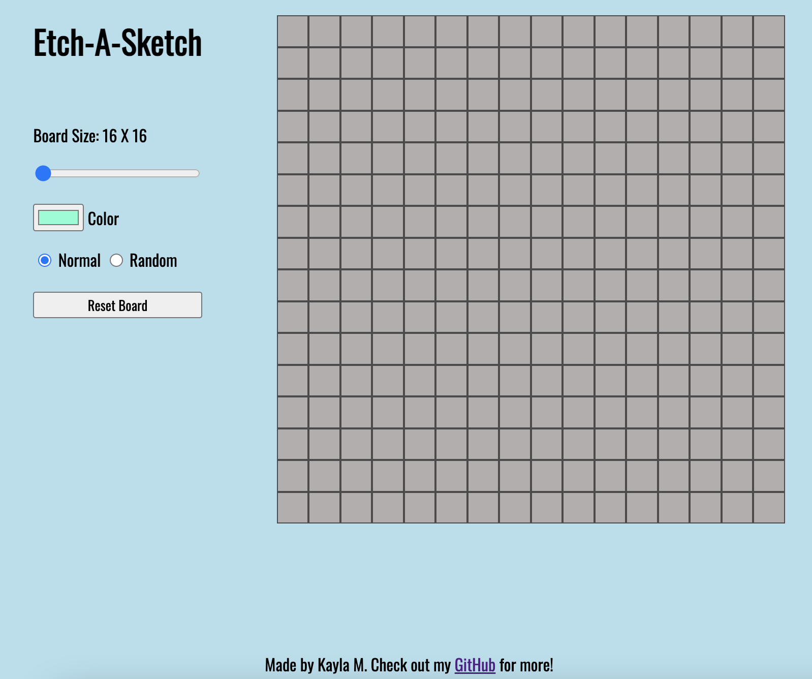

# etch-a-sketch

Live Site: [Etch-A-Sketch](https://kaykaym01.github.io/etch-a-sketch/)

[The Odin Project: Etch A Sketch Challenge](https://www.theodinproject.com/lessons/foundations-etch-a-sketch)

Site Screenshot:

Features:
* Similar to an old school etch-a-sketch, users hover over the squares to create images
* User can select color of cells or select Random for Random colors
* User can also re-size the grid layout from 16x16 to 96x96 without using extra screen space
* Reset Board button will clear board of all colors

Developed using HTML/CSS/JavaScript